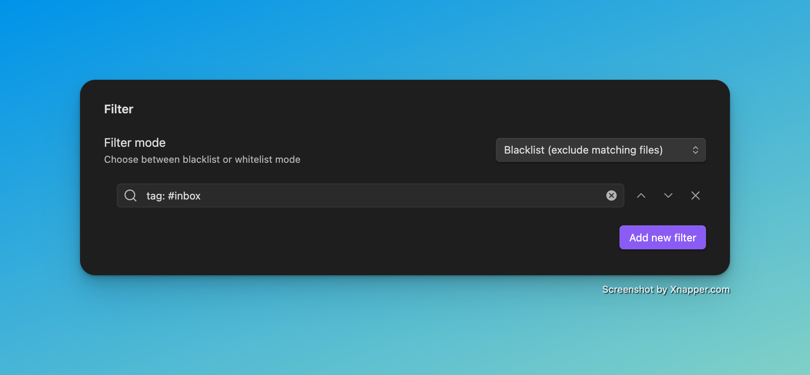

# NoteMover Shortcut
NoteMover Shortcut is a plugin for [Obsidian](https://obsidian.md).

## Description
The "NoteMover Shortcut" plugin streamlines your note organization in Obsidian. It offers a suite of shortcuts to:
- **Move Single Notes**: Swiftly relocate the currently open note to a specified destination folder.
- **Batch Move Notes**: Efficiently transfer all notes from a designated "Inbox" folder to appropriate target folders based on tags.

## Difference to obsidian-auto-note-mover
This plugin focuses on manual control with optional lightweight automation. Unlike obsidian-auto-note-mover, which automatically moves notes on every save, obsidian-note-mover-shortcut allows you to move notes via keyboard shortcut or through periodic scheduled moves.

## Difference to obsidian-auto-note-mover
While both plugins aim to help you organize your notes, this plugin focuses on manual control with optional light automation, and offers features not found in Auto Note Mover.

### Key differences:
- History support – recently moved notes are tracked and can be restored with one click
- One-click inbox sorting – move all notes from a folder (e.g. your inbox) at once via a command or shortcut

### Looking ahead:
Large improvements are planned — especially around the rule system, which will allow for even more powerful and flexible note organization in the future.
This will further distinguish this plugin for users who want a balance between structure, automation, and control.

## Configuration
### Settings:

#### Basic Settings
- **Inbox folder**: Specify the path to your inbox folder where new notes are initially stored.
- **Note folder**: Specify the path to your main note folder where notes will be moved to by default.

#### Periodic Movement

- **Enable periodic movement**: When enabled, the plugin will automatically move notes from the inbox folder at regular intervals.
- **Periodic movement interval**: Set the interval in minutes between automatic note movements (minimum: 1 minute).

#### Filter Settings

- **Enable filter**: When enabled, you can specify which notes should be moved based on their tags.
- **Toggle blacklist/whitelist**: Choose between:
  - **Blacklist**: Move all notes EXCEPT those with specified tags
  - **Whitelist**: Move ONLY notes with specified tags
- **Filter tags**: Add tags to include/exclude from movement based on your blacklist/whitelist setting.

#### Rules

- **Enable rules**: When enabled, you can define custom rules for moving notes based on their tags.
- **Rule configuration**: For each rule, specify:
  - **Tag**: The tag that triggers the rule
  - **Path**: The destination folder for notes with this tag
  - Note: If a note has multiple tags that match rules, the first matching rule will be applied.

### Hotkeys:
- Set Hotkeys to the NoteMover Commands

## Usage
1. **Configuration:** Configure your folders and rules as described in the [Configuration section](#configuration)
2. **Open Note:** Open the note you want to move.
3. **Execute Command:** Execute one of the NoteMover commands from the command palette or use your configured shortcuts.

### Available Commands

The plugin provides the following commands that can be accessed through the command palette or configured with custom hotkeys:

#### Move Active Note
- **Command ID**: `trigger-note-movement`
- **Name**: "Move active note to note folder"
- **Description**: Moves the currently active note to the configured note folder. If rules are enabled, the note will be moved according to its tags.
- **Usage**: Open the note you want to move and execute this command.

#### Bulk Move Notes
- **Command ID**: `trigger-note-bulk-move`
- **Name**: "Move all notes from inbox to notes folder"
- **Description**: Moves all notes from the configured inbox folder to their respective destination folders based on the current settings:
  - If rules are enabled, notes will be moved according to their tags
  - If filters are enabled, only notes matching the filter criteria will be moved
  - Otherwise, all notes will be moved to the default note folder
- **Usage**: Execute this command to process all notes in your inbox folder at once.

#### History and Undo

- **Command ID**: `show-note-mover-history`
- **Name**: "Show NoteMover History"
- **Description**: Displays a history of all note movements performed by the plugin, allowing you to review and undo previous actions.
- **Usage**: Execute this command to open the history view, where you can:
  - View a chronological list of all note movements
  - See the source and destination paths for each move
  - Undo individual movements or bulk operations
  - Filter the history by date or operation type

## Contributing:
This plugin is open-source. Contributions are welcome!

## Features
- **Active Note Move**: Move the active note from the current location to the main notes folder with a single command
- **Bulk Move**: The ability to move all notes from an "Inbox" folder to the main notes folder with a single command, saving you time and simplifying organization.
- **Tag-Based Moving**: Move notes to different destination folders based on their tags, allowing for even more granular organization of your notes.
- **Automated Moving**: A feature that periodically moves notes from the "Inbox" folder if they meet specific criteria, such as lacking an "#inbox" tag.
- **History Tracking**: Keep track of all note movements with a detailed history view
- **Undo Functionality**: Easily revert any note movements if needed, with support for both individual and bulk operations
