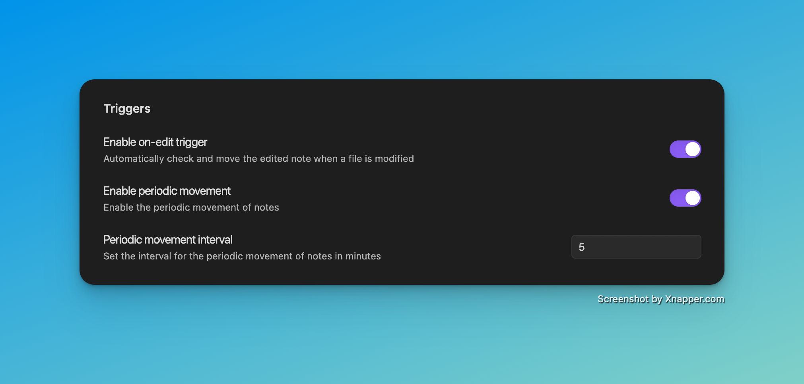

# NoteMover Shortcut

NoteMover Shortcut is a plugin for [Obsidian](https://obsidian.md).

## Description

The "NoteMover Shortcut" plugin streamlines your file organization in Obsidian. It offers a suite of shortcuts to:

- **Move Single Files**: Swiftly relocate the currently open file to an appropriate destination folder based on rules and filters.
- **Batch Move Files**: Efficiently transfer all files in your vault to appropriate target folders based on various criteria including tags, properties, file names, content, paths, and dates.

## Configuration

### Settings:

#### Trigger Settings

- **Enable on-edit trigger**: When enabled, the plugin listens for file modifications (on edit) and automatically checks the edited note against your rules and filters. If a positive match is found, the note is moved immediately after the edit.
- **Enable periodic movement**: When enabled, the plugin will automatically move all files in your vault at regular intervals.
- **Periodic movement interval**: Set the interval in minutes between automatic file movements (minimum: 1 minute).

Notes:

- The on-edit trigger only reacts to Markdown files and runs the same rule- and filter-based movement logic as manual commands.
- Periodic movement has been refactored to use the same unified event handler as the on-edit trigger, ensuring consistent behavior and a single orchestration point.

#### Filter Settings

- **Toggle blacklist/whitelist**: Choose between:
  - **Blacklist**: Move all files EXCEPT those matching the specified criteria
  - **Whitelist**: Move ONLY files matching the specified criteria
- **Filter criteria**: Add criteria to include/exclude from movement. Supported types:
  - **Tags**: `tag: tagname` - Match files with specific tags (e.g., `tag: #inbox`, `tag: work/project`)
  - **Properties**: Property-based criteria from frontmatter:
    - `property: key` - Match files that have the specified property key
    - `property: key:value` - Match files where the property key has the exact value
    - Example: `property: status:draft`, `property: type:meeting`
  - **File Names**: `fileName: pattern` - Match files by filename patterns (e.g., `fileName: *.json`, `fileName: Daily`)
  - **Content**: `content: text` - Match files containing specific text in their content
  - **Path**: `path: folder/path` - Match files located in specific folder paths
  - **Creation Date**: `created_at: date` - Match files based on creation date
  - **Update Date**: `updated_at: date` - Match files based on last modification date

#### Rules

- **Rules description**: Define custom rules for moving files based on various criteria. Rules are always active.
- **Only move files with rules**: When enabled, only files matching defined rules will be moved, others remain untouched. When disabled, files without matching rules are moved to the root folder.
- **Rule configuration**: For each rule, specify:
  - **Criteria**: The criteria that triggers the rule. Supported types:
    - **Tags**: `tag: tagname` - Trigger for files with specific tags
      - Supports subtags (e.g., `tag: work/project` matches both `#work/project` and `#work`)
      - Example: `tag: meeting`, `tag: #inbox`
    - **Properties**: `property: key` or `property: key:value` - Trigger based on frontmatter properties
      - `property: key` - Trigger for files that have the specified property key
      - `property: key:value` - Trigger for files where the property key has the exact value
      - Example: `property: type:meeting`, `property: urgent`
    - **File Names**: `fileName: pattern` - Trigger for files matching filename patterns
      - Supports wildcards (e.g., `fileName: *.json`, `fileName: Daily*`)
      - Example: `fileName: Meeting`, `fileName: *.md`
    - **Content**: `content: text` - Trigger for files containing specific text
      - Example: `content: TODO`, `content: urgent`
    - **Path**: `path: folder/path` - Trigger for files in specific locations
      - Example: `path: Inbox/`, `path: Templates/`
    - **Creation Date**: `created_at: date` - Trigger based on when the file was created
    - **Update Date**: `updated_at: date` - Trigger based on when the file was last modified
  - **Path**: The destination folder for files matching this criteria
  - Note: If a file matches multiple rules, the first matching rule will be applied.
  - Note: Destination folders will be created automatically if they don't exist.

### Example Configurations

#### Advanced Rule Examples

You can use different criteria types for sophisticated file organization:

**Filter Examples**:

- **Whitelist**: `tag: #inbox`, `property: status:draft`, `fileName: *.json`
  - Only moves files with the inbox tag, OR draft status, OR JSON files
- **Blacklist**: `content: private`, `path: Archive/`
  - Moves all files EXCEPT those containing "private" or located in Archive folder

**Rules Examples**:

1. `property: type:meeting` → `Meetings/`
2. `fileName: Daily*` → `Daily Notes/`
3. `tag: work/urgent` → `Work/Priority/`
4. `content: TODO` → `Tasks/`
5. `path: Inbox/` → `Processed/`
6. `created_at: 2024-01-01` → `Archive/2024/`

**Complex Workflow Example**:

- **Filter (Whitelist)**: `tag: #process`, `property: status:ready`
- **Rules**:
  1. `property: type:project` → `Projects/Active/`
  2. `fileName: Meeting*` → `Meetings/`
  3. `content: urgent` → `Priority/`
  4. Default: `Processed/`

This setup will only process files tagged with #process OR having status:ready, then move them based on their type, filename pattern, or content.

### Hotkeys:

- Set Hotkeys to the NoteMover Commands

## Usage

1. **Configuration:** Configure your rules and filters as described in the [Configuration section](#configuration)
2. **Open File:** Open the file you want to move (optional for bulk operations).
3. **Execute Command:** Execute one of the NoteMover commands from the command palette or use your configured shortcuts.

### Available Commands

The plugin provides the following 6 commands that can be accessed through the command palette or configured with custom hotkeys:

#### Move Active File

- **Command ID**: `trigger-note-movement`
- **Name**: "Move active note to note folder"
- **Description**: Moves the currently active file to an appropriate destination folder based on rules and filters. Includes preview functionality to show the destination before moving.
- **Usage**: Open the file you want to move and execute this command.

#### Bulk Move Files

- **Command ID**: `trigger-note-bulk-move`
- **Name**: "Move all files in vault"
- **Description**: Moves all files in your vault to their respective destination folders based on the current settings:
  - Files will be moved according to their criteria using rules
  - If "Only move files with rules" is enabled, only files matching defined rules will be moved
  - Files will be filtered based on the filter criteria
  - Files without matching rules will be moved to the root folder
  - **Preview**: Shows a preview of all files to be moved and their destinations before execution
- **Usage**: Execute this command to process all files in your vault at once.

#### History and Undo

- **Command ID**: `show-history`
- **Name**: "Show history"
- **Description**: Displays a history of all file movements performed by the plugin, allowing you to review and undo previous actions.
- **Usage**: Execute this command to open the history view, where you can:
  - View a chronological list of all file movements
  - See the source and destination paths for each move
  - Undo individual movements or bulk operations
  - **Bulk Undo**: Select and revert multiple movements at once for efficient history management
  - Filter the history by date or operation type

#### Move Preview

- **Feature**: File Move Preview
- **Description**: Before executing any move operation, you can preview which files will be moved and where they will be relocated.
- **Benefits**:
  - **Safe Operations**: See exactly what will happen before committing to the move
  - **Bulk Move Confidence**: Preview all files that will be processed in bulk operations
  - **Rule Validation**: Verify that your rules and filters are working as expected
- **Usage**: The preview functionality is automatically triggered before move operations, showing:
  - List of files to be moved
  - Source and destination paths for each file
  - Applied rules or criteria for each move
  - Option to proceed or cancel the operation

#### Show Update Modal

- **Command ID**: `show-update-modal`
- **Name**: "Show update modal"
- **Description**: Manually displays the update modal showing changelog information for the current version.
- **Usage**: Execute this command to view the changelog and update information, useful for reviewing new features and changes.

#### Preview Bulk Movement

- **Command ID**: `preview-bulk-movement`
- **Name**: "Preview bulk movement for all files"
- **Description**: Shows a preview of all files that would be moved in your vault without actually executing the move operation.
- **Usage**: Execute this command to:
  - See which files would be affected by a bulk move
  - Preview destination paths for each file
  - Review applied rules and filters
  - Plan your bulk operations safely

#### Preview Active File Movement

- **Command ID**: `preview-note-movement`
- **Name**: "Preview active note movement"
- **Description**: Shows a preview of where the currently active file would be moved based on your current rules and settings.
- **Usage**: Open the file you want to preview and execute this command to:
  - See the destination path before moving
  - Verify that rules are working as expected
  - Make informed decisions about file placement

## Contributing:

This plugin is open-source. Contributions are welcome!

## Features

- **Active File Move**: Move the active file to an appropriate destination folder based on rules and filters with a single command
- **Bulk Move**: The ability to move all files in your vault to appropriate destination folders with a single command, saving you time and simplifying organization.
- **Advanced Criteria-Based Moving**: Move files to different destination folders based on various criteria including tags, properties (frontmatter), file names, content, paths, and dates, allowing for sophisticated file organization.
- **Selective Rule-Based Movement**: Option to only move files that match defined rules, providing flexibility for users who want selective file processing based on specific criteria.
- **Automated Moving**: Two automation modes:
  - On-Edit Trigger: Automatically checks and moves the just edited note.
  - Periodic Movement: Periodically moves files across the vault at a configured interval.
- **Move Preview**: Preview which files will be moved before execution, ensuring safe and predictable operations
- **History Tracking**: Keep track of all file movements with a detailed history view
- **Undo Functionality**: Easily revert any file movements if needed, with support for both individual and bulk undo operations
